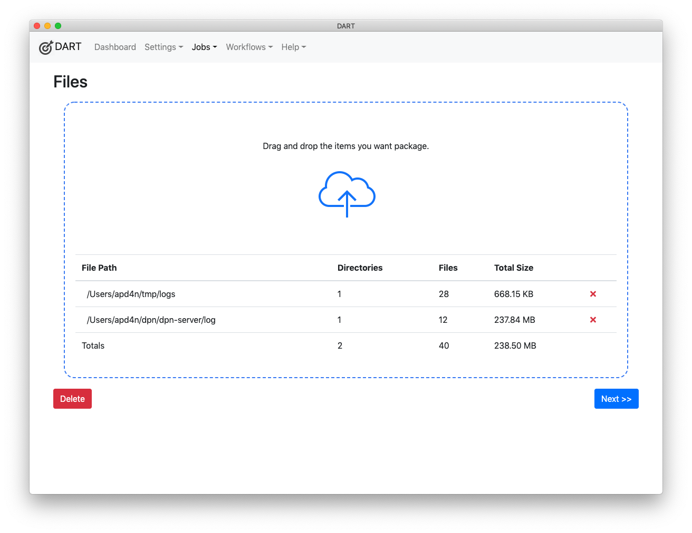

# Deleting Jobs

To delete a job:

1. Choose __Jobs &gt; List__ from the menu.

1. Click on the job you want to delete.

    

1. Click the red __Delete__ button in the bottom left corner of the Job files page.

    
