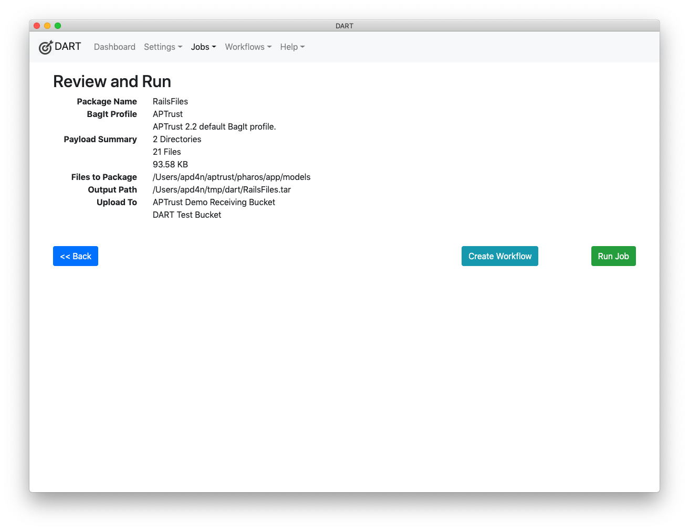

# Run Your Job

After defining the files your job will work with and the optional packaging, metadata, and upload steps, the Run page displays a summary of the work that DART will perform. Review the details to ensure that everything looks right, then click the __Run__ button to run the job.

After clicking run, your job will begin. DART runs each job in a separate process, which provides a number of benefits:

1. You can run many jobs at once.
1. If any job encounters errors, it will not affect the other running jobs.
1. You can continue to use DART while background jobs run. Nothing you do in DART, except quitting the application, will affect the running jobs.

After clicking __Run__, you'll see the progress of each operation on screen. Striped blue bars indicate a work in progress. A green bar represents a completed operation, while a red bar indicates a failure. If a job includes multiple uploads, you'll see one progress bar for each upload.

__Note:__ Some members have issues using DART to upload large bags (400GB or larger) because of local networking infrastructure. If you encounter this, we recommend using DART to create bags and using a third-party S3 client (e.g., <a href="https://cyberduck.io/" target="_blank">Cyberduck</a>, <a href="https://s3browser.com/" target="_blank">S3 Browser</a>) to upload them.

Large jobs may take a long time to complete. As long as jobs are running, you can continue to work in DART without affecting their progress. You'll see a badge like this in the upper right corner of the menu showing the number of running background jobs:

## Progress Bar Accuracy

The progress bars for packaging and validation are accurate to within a few seconds of actual operation time. The progress bar for uploads usually displays more progress than has actually been completed. This is because DART can know exactly how many bytes of an upload it has prepared to send, but not how many the upload target has received.

The upload progress bar displays the number of bytes prepared, and will appear to stall at around 98% completion on large uploads, as it awaits transferral of the final chunk of data. In a 100 MB upload, that final chunk may include only 1 MB of data, taking a few seconds to transfer. In a 5 TB upload to S3, the final chunk can be 535 MB and can take many minutes to complete.

## Creating a Workflow from a Job

If you've created a successful job that you want to be the pattern for future jobs, click the __Create Workflow__ button to create a repeatable [workflow](../workflows/index.md) that can run new files through the same set of steps that this job just completed.
