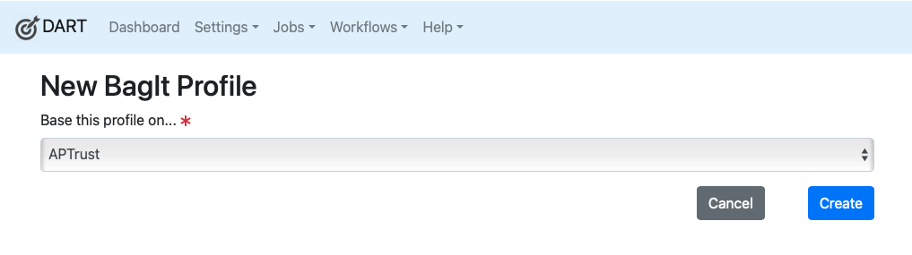

# Creating Profiles

To create a new BagIt Profile:

1. Choose <b>Settings &gt; BagIt Profiles</b> from the menu.

1. Click the __New__ button at the top of the profiles list.

1. Select an option from the __Base Profile__ list.

    1. Chose __None__ if you want to create a new profile from scratch.

    1. Choose the name of an existing profile if you want to clone and modify
       an existing profile.

1. Click the __Create__ button.

!!! note
    Cloning an existing BagIt profile can be useful if you're going to create
    bags on behalf of more than one organization or group. You can set different
    default values for tags such as `Source-Organization` or `Contact-Email`
    within each cloned profile, and then assign meaningful names such as
    `APTrust Profile for Law Library` and `APTrust Profile for Engineering
    Library`.

Once you've created a new BagIt profile, you'll want to customize it using
the built-in BagIt profile editor.

See also: [Customizing BagIt Profiles](customizing.md)
