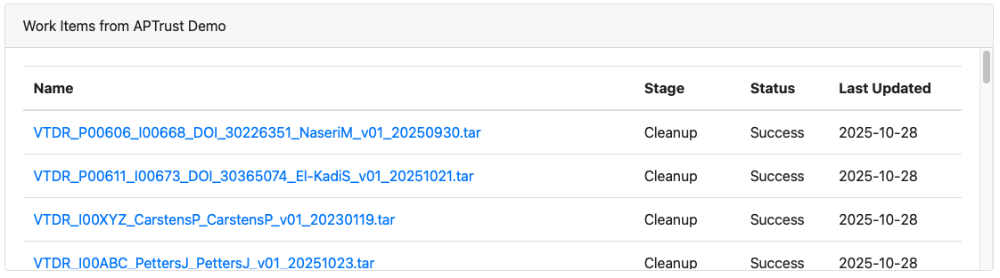

# Dashboard

The dashboard shows running jobs, recently completed jobs, and selected items from remote repositories.

## Recent Jobs

The Recent Jobs panel lists recently completed jobs. The Outcome column shows the job's last completed step, while the Date column shows when that step was completed. You can get more detailed information by clicking <b>Jobs &gt; List</b> from the top menu.

See also: [Jobs](jobs/index.md)

## Repositories

The Repositories panels show items from remote repositories that DART knows how to connect to. In the screenshot above, this panel shows items recently ingested into APTrust's demo repository:

The panel below shows a list of pending or recently completed tasks from APTrust demo system. Some repository panels, such as those from APTrust, show additional information when you mouse over an item.

The panels show errors if they cannot communicate with the remote repository. If you run into errors like this, chances are your [Remote Repository](settings/remote_repositories.md) is incorrectly configured.

!!! info
    Remote repository panels require both a correctly configured Remote Repository
    setting and DART code that knows how to communicate with the remote repository.
    Currently, DART supports only APTrust repositories. Developers may contribute
    custom code for other repositories that have a REST API. The DART code repository
    is public and open source. It's located at https://github.com/APTrust/dart.

See also: [Remote Repository](settings/remote_repositories.md)
