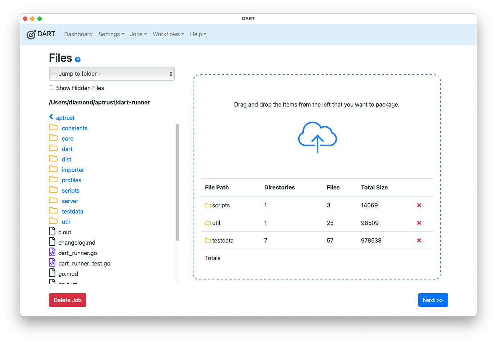

# Getting Started

DART is the Digital Archivist's Resource Tool. Its primary purpose is to package digital materials and send them off to long-term preservation storage. DART's initial release focuses on packaging materials in BagIt format and uploading them to S3 buckets for ingest in APTrust. DART can be extended through plugins to produce other packaging formats and to communicated via additional network protocols.

DART runs in both graphical and command-line modes on Windows, Mac, and Linux. What can you do with it? The video below gives a sample. Note that this video shows the DART 2 interface. DART 3 is similar, except that files must be dragged in from the file navigator in the left side bar.

<iframe width="845" height="479" src="https://www.youtube.com/embed/_ga9XfuyO-I" frameborder="0" allow="accelerometer; autoplay; clipboard-write; encrypted-media; gyroscope; picture-in-picture" allowfullscreen></iframe>

## Installation

{! dart3/shared/downloads.md !}

## Set Up

After installation, DART includes two BagIt profiles by default, one for APTrust and one for DPN. You can use one of these two profiles to create your first job. While jobs can include packaging, validation, and upload operations, you won't be able to upload anything until you've set up a [Storage Service](settings/storage_services.md) to receive an upload. With this, your first job will be limited to creating and validating a BagIt bag.

## Running Your First Job

Follow these steps to create a valid local bag that conforms to the APTrust BagIt profile:

1. Choose __Jobs &gt; New__ from the main menu.

    

2. Drag some files or folders from the file browser on the left side of the window into the files area on the right. To avoid a long-running job that will consume a lot of disk space, choose only a few megabytes of files.

    

3. Click __Next__ and set the following:

    1. __Packaging Format__: BagIt
    1. __BagIt Profile__: APTrust
    1. __Package Name__: test_bag
    1. __Output Path__: Don't edit this for now. DART will set it for you.

    

4. Click __Next__ and set the required metadata attributes, which are marked with a red asterisk. For an APTrust bag, these include the __Access__ and __Title__ tags in the aptrust-info.txt file, and the __Source-Organization__ tag in the bag-info.txt file.

    

5. Click __Next__ to choose the upload targets. Since there will be no available upload targets after initial installtion, Click __Next__ again.

6. The __Review and Run__ screen shows the details of the job you've just defined. Click __Run Job__ to run the job.

    

When the job is complete, you'll find your bag in the __Output Path__ displayed on the __Review and Run__ screen.

## DART User Group

APTrust hosts a [DART User Group](https://aptrust.org/resources/user-groups/dart-user-group/) for the entire digital preservation community. This group will primarily be a [mailing list](https://groups.google.com/a/aptrust.org/g/dart-users), where users can share experiences, ask questions, and support one another. Depending on the level of interest and engagement, we may expand this initiative to include regular virtual meetings and more structured activities in the future.

## Further Reading

[BagIt Profiles](bagit/index.md) describes how to build and customize BagIt profiles, so DART can build bags exactly as you want them. Be sure to read the section on tag default values under [Editing a Tag](bagit/customizing.md#editing-a-tag). That will save you from re-entering common tag values, such as Source-Organization, every time you create a new bag.

The [Dashboard](dashboard.md) displays information about currently running and recently completed jobs. If you've configured [Remote Repository](settings/remote_repositories.md) connections, the dashboard can show the status of recent and pending ingests.

To get details about what DART is doing, check the [Logs](logs.md).

The [Settings](settings/index.md) section describes how to set up upload targets, remote repository connections, and more.

Organizations that distribute DART to their members can [Export Settings](settings/index.md) to help users quickly configure DART for their needs.

After you've defined and tested a successful job, you can convert it to a [Workflow](workflows/index.md) to run other files through the same process.

APTrust members may also wish to consult the [Deposit Guidelines](https://aptrust.github.io/userguide/depositing/guidelines/) when preparing deposits.