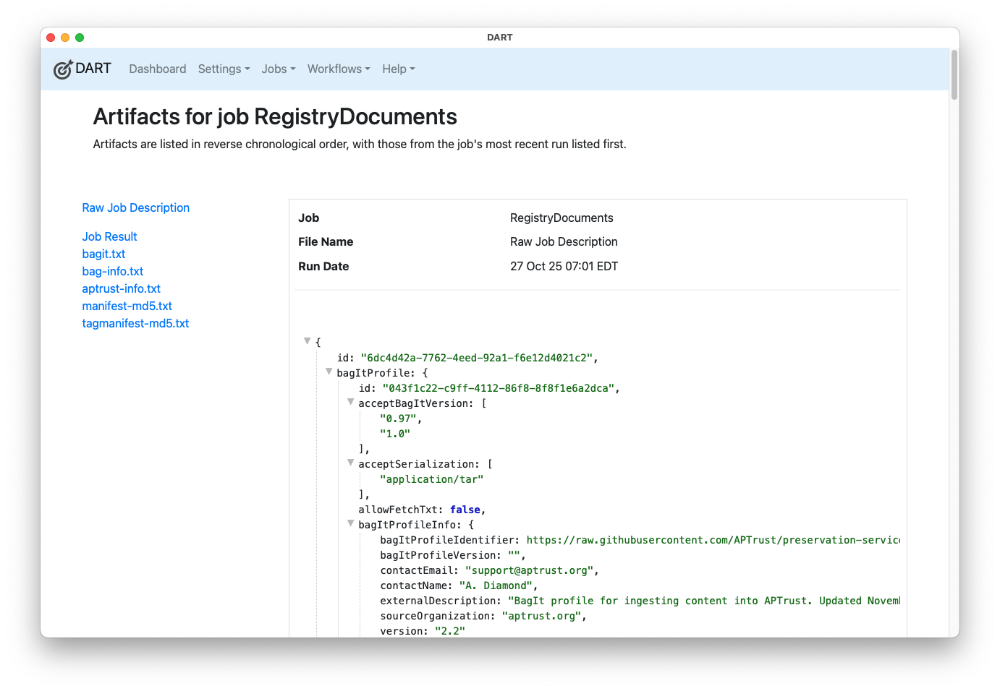
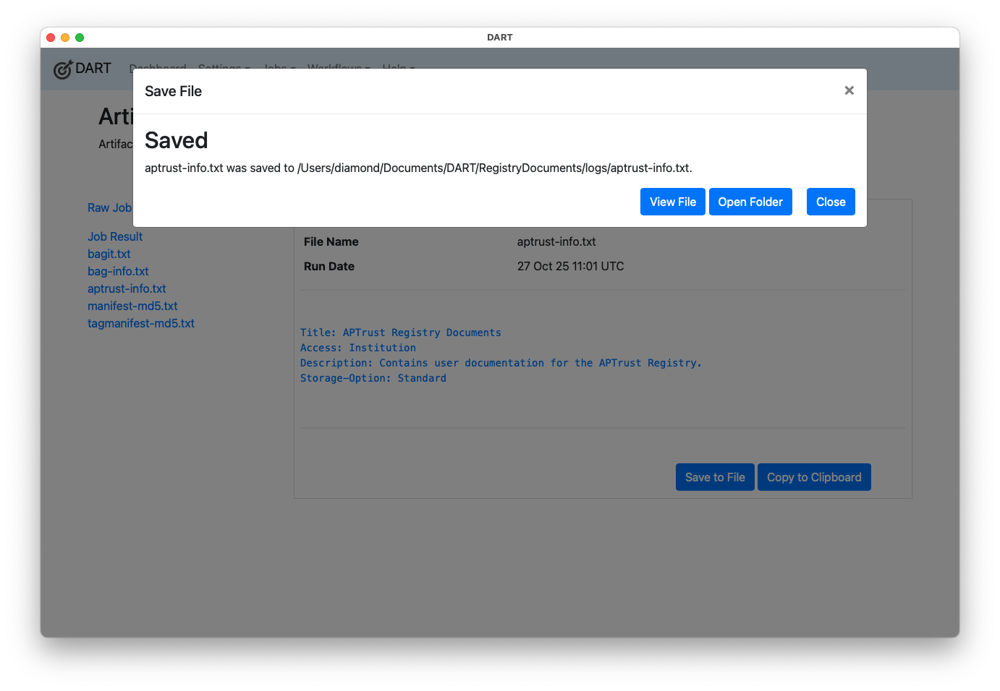

# Job Artifacts

After running a job, DART 3 keeps a copy of the job's artifacts in its local database. These artifacts let you know what the job was intended to do, how it turned out, and which files and metadata were added into the bag. Artifacts are described below.

Note that you can copy the contents of any of these files to the clipboard by clicking the file name in the left side bar and then clicking the **Copy to Clipboard** button. From there, you can paste the contents into another file.

You can also save a file directly to disk by clicking **Save to File** [as described below](#saving-artifacts-to-a-local-file).

## Manifests

Manifests include all of the payload and tag manifests that were created as part of the bag, so you know not only what was packaged, but also the checksums of those files.

## Tag Files

Tag files include all of the tag files that went into the bag during the bagging operation. Tag files should always include bagit.txt and bag-info.txt, and may include others, depending on the BagIt profile. (For example, APTrust's profile requires an `aptrust-info.txt` file, and this will appear in the list of tag files after the job is run.) Tag files contain the bag's essential metadata.

## Job Description

The Raw Job Description is a JSON file that describes what actions were performed, including:

  - Which files were bagged
  - Which BagIt profile was used
  - The result of the validation operation
  - The list of remote S3 and/or SFTP services to which the bag was uploaded

## Job Result

This JSON file describes the result of each step of the bagging, validation, and uploading operations from the job description. The result includes error messages describing why any step of the operation failed.

## Saving Artifacts to a Local File

DART keeps artifacts in its local sqlite database. If you want to export the contents of a manifest, tag file, job description or job result to a file, click the **Save to File** button. DART will save the file and show you where it put it. Saved files will go into a directory under Documents/DART, as shown below.

