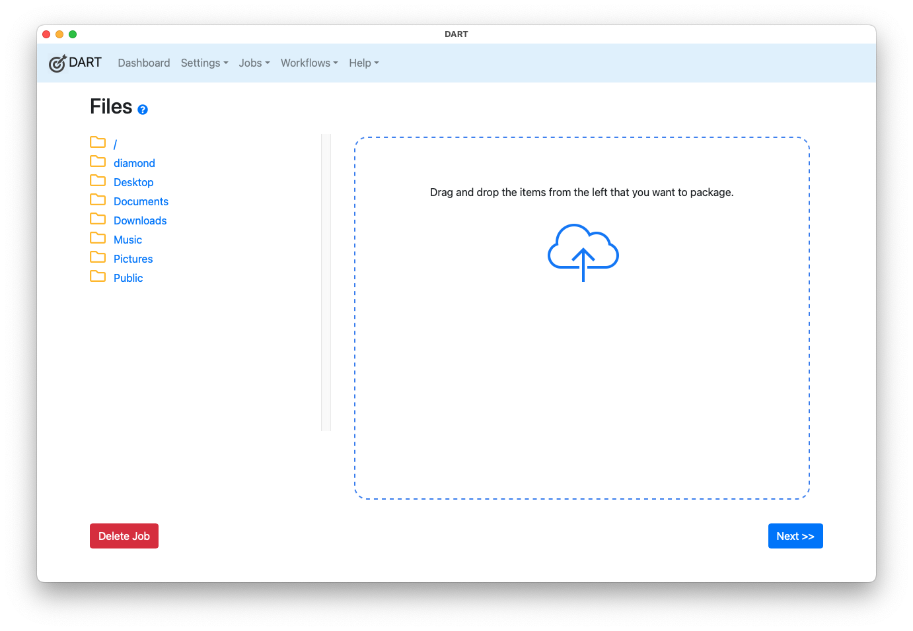
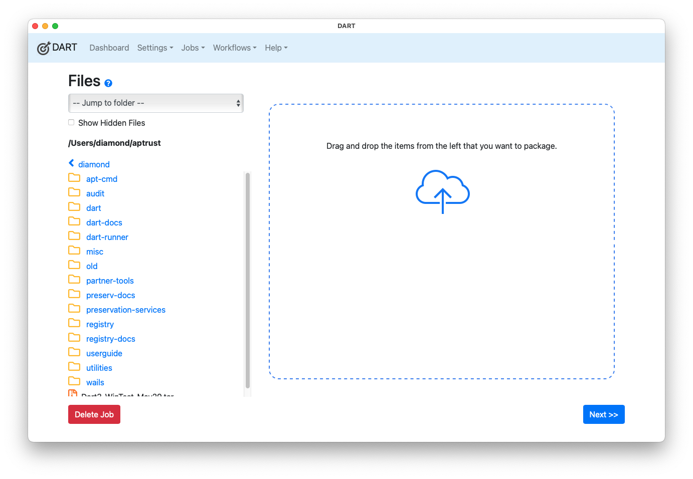
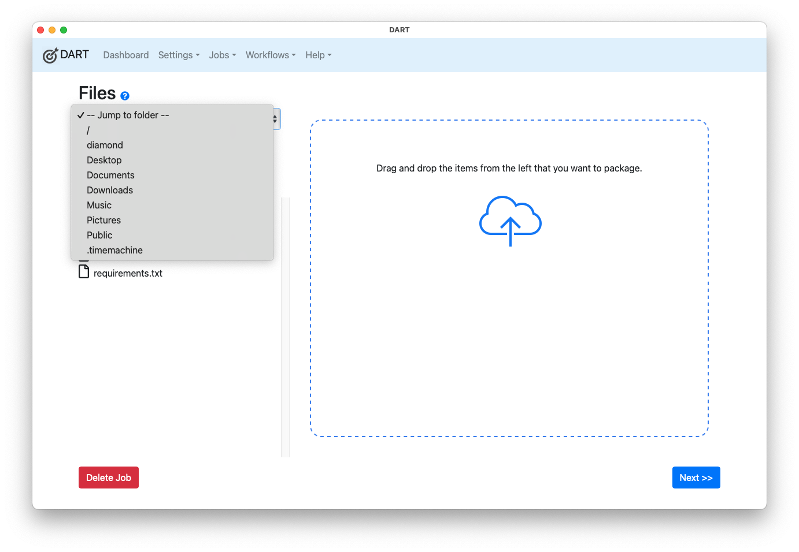

# Adding Files

After you create a new job or click on a job in the Jobs list, you'll see the files page. You can add files to a job by dragging them from the file browser on the left side of the window into the drop zone on the right, which is outlined in blue.

The files window shows the total number of files and directories you've added, and total size of all the files.

After adding files and directories, click the __Next__ button to move on to the [Packaging](packaging.md) step. Note that you can also delete the job from this screen.

## Removing Files

To remove a file from the job, click the red X in the row of the file you want to delete.

## DART 3 File Browser

DART 3 does not yet support dragging and dropping from the desktop, or from your operating system's file browser. Instead, it includes a built-in file browser on the left side of the files screen.

When you first open the files window, DART shows the following folders by default:

  - Your home directory
  - Your Desktop directory
  - Documents
  - Downloads
  - Music
  - Pictures / Photos
  - Your Public directory

From here, you can do the following:

  - Click on a folder to open it
  - Drag a folder or file into the packaging area on the right if you want to include it in the bag

## Opening a Directory

Clicking a directory name will open the directory and show you what's inside. Note that the name of the open directory appears in bold above the list of contents.

## Showing Hidden Files

The **Show Hidden Files** checkbox controls whether a directory's hidden files appear or not. This is what a directory looks like with hidden files hidden:

This is the same directory with hidden files displayed:

Note that hidden files and directories such as `.git` and `.DS_Store` usually being with a period.

## Jump Menu

The top of the files list includes a jump menu that lets you jump from your current location back to any of the primary folders in the default files list. This makes it easy for you to get back to your Desktop or Documents folder from any subdirectory.

