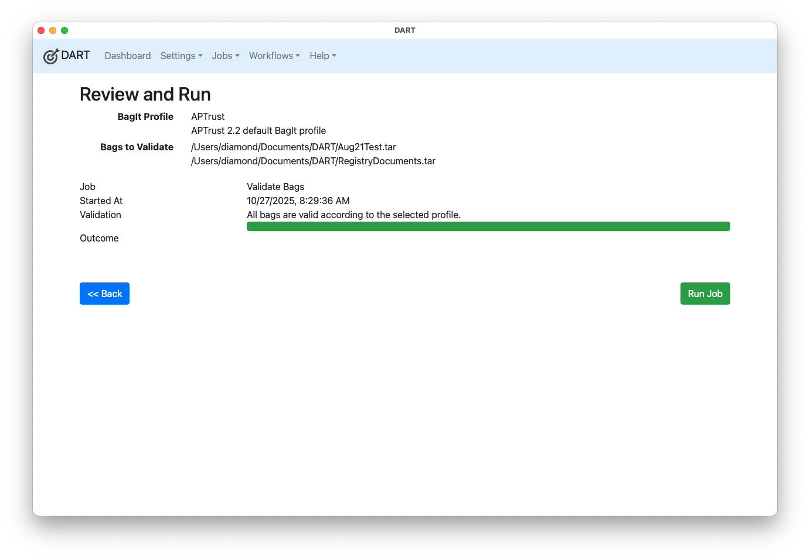

# Validation Jobs

If you simply want to validate an existing bag, follow these steps:

1. Choose __Jobs &gt; Validate Bags__ from the menu.

1. DART will display the contents of the bagging directory (which is defined in [Application Settings](../settings/app_settings.md)). If the bags you want to validate are not in this directory, use the jump menu at the top of file browser to go to another directory.

    

1. Drag one or more bags from the file browser onto the right side of the screen. The image below shows two bags selected for validation.

    

1. Click __Next__.

1. Choose the BagIt profile against which you want to validate. If you want to validate against the BagIt specification instead of a specific profile, choose the "Empty Profile."

    

    !!! note
        When you choose a profile, all of the bags you selected for validation will be checked against that profile. Some bags that do not conform to the selected profile may fail validation, even if they are valid according to _other_ BagIt profiles. For example, if you choose the APTrust profile and one of your bags was created using the Beyond the Repository (BTR) profile, that bag will fail. Even though it may be a valid BTR bag, it is not a valid APTrust bag. Be sure that all of the bags you want to validate conform to the specification you have chosen. If you just want to confirm that a bad adheres to the general BagIt specification, choose _Empty Profile_. The empty profile simply ensures that the bag meets the bare minimum bagging requirements, without requiring any organization-specific add-ons such as special tag files, additional tags, or specific manifest algorithms.

1. Click __Next__.

1. Click __Run Job__.

    

The progress bar will show the progress of the job, and DART will display specific error messages below the progress bar when the job is complete.

Note that a bag that is valid according to one profile may be invalid according to others. If a bag is valid according to the Empty Profile, it conforms to the general <a href="https://tools.ietf.org/html/rfc8493" target="_blank">IETF BagIt specification</a>.

## A Note on Mac OS Dot-Underscore Files

DART may report a number of errors for tarred bags created on Mac OS, stating that .DS_Store files or files beginning with "._" were found in the payload but not in the manifests.

Typically, there will be one dot-underscore file for each payload file, like so:

* data/article.pdf -> data/._article.pdf
* data/image.jpg -> data/._image.jpg

These files contain metadata used by the Mac OS filesystem. When you tar a bag with the typical command, `tar -cf mybag.tar mybag`, Mac includes the dot-underscore files by default, but your bagging software may not include those hidden files in the manifests, so the DART validator considers the bags invalid, with messages like "File data/._image.jpg found in data directory is not present in manifest-sha256.txt."

When tarring your own bags outside of DART, you get around this problem with the command `COPYFILE_DISABLE=1 tar -cf mybag.tar mybag`. That tells Mac's tar program to exclude dot-underscore files from the tarball.
