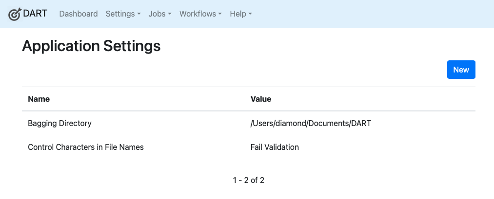

# App Settings

App Settings contain DART's application-wide settings. These may be used when creating bags and other packages. To view the list of all settings, select <b>Settings &gt; App Settings</b> from the main menu.

## Editing App Settings

Click on any setting in the list to edit it. Note that some essential settings, such as _Bagging Directory_ and _Institution Domain_ cannot be renamed or deleted, though their values can be changed.

## Built-in Settings

DART 3 has two built-in app settings.

  - **Bagging Directory** is the path to the directory in which DART will create new bags. By default, this is set to a directory called DART inside your Documents directory. In some cases, you may want to change this. For example, if you are running out of disk space and you want to create a very large bag, you can plug in an external drive and tell DART to build new bags there.
  - **Control Characters in File Names** describes what DART should do when it encounters control characters in file names inside of bags. Control characters include tabs, half-space Unicode characters used in Mac OS's screenshot names, and a number of other characters that are either unprintable or don't play nice with certain file systems. In some cases, these characters can prevent files from being copied to remote SFTP and S3 servers. In general, if you're copying a tar or gzip file to a remote SFTP or S3 service, you won't need to care about control characters in file names. If you're copying loose files (not tarred or gzipped), you might need to care, as these systems may reject the files because they can't properly store the file names. This setting has four options:
      - **Ignore** means DART should ignore the fact that some file names contain potentially invalid characters. That is, DART should just happily bag and validate them as if they will never present a problem.
      - **Warn** means DART should bag and validate files with potentially problematic file names and warn you if it sees them. This is probably the best setting for most users, as it can tell you why a remote SFTP or S3 server won't accept them. (Again, if you're uploading tarred or gzipped bags, S3 and SFTP won't care what's inside them, so you won't see a problem.)
      - **Refuse to Bag** means DART will not create bags if it sees problematice characters in the names of the files going into that bag. DART will also cause those bags to fail validation. Use this option if you want to root out potentially bad file names before bagging. DART will tell you which files are causing the problems.
      - **Fail Validation** means DART will create bags with problematic file names but they will fail DART's own validation process.

!!! note
    APTrust users should choose either **Refuse to Bag** or **Fail Validation**. Because APTrust unpacks tarred bags in S3 after depositors upload them, files whose names contain unprintable characters or certain Unicode characters are rejected by S3, causing ingest to fail.
