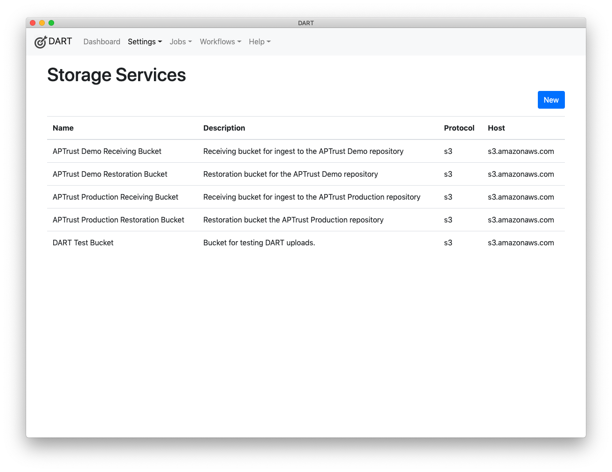
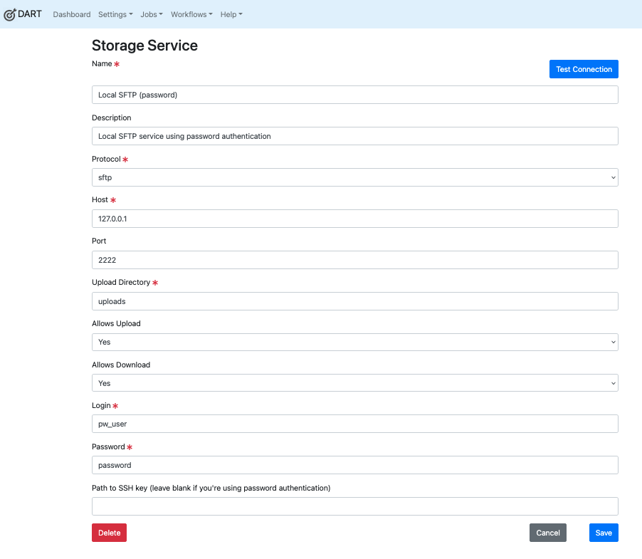

# Storage Services

Storage services are not repositories! They are pickup and drop-off points for materials going into or coming out of repositories. Some repositories ask depositors to upload materials into an S3 bucket or an SFTP folder for ingest, and restore materials to a similar bucket or folder for depositors to retrieve.

Storage services allow DART to connect to these pickup and drop-off points. Note, however, that you're free to send data to and from these storage services even if they're not ultimately bound for a preservation repository.

## Listing Storage Services

To list all storage services, choose __Settings &gt; Storage Services__ from the menu.

## Editing Storage Services

Click any storage service in the list to edit it.

### Description of Settings

#### Name
The name of the service. Choose a name that's meaningful to you and that differentiates this service from others. You can change the name at any time without affecting the behavior or availability of the service.

#### Description
A description of this service.

#### Protocol
Choose the network protocol used to communicate with this service. Note: At launch, DART supports only the S3 protocol.

#### Host
Enter the name or IP address of the service host. Do not include protocol prefixes like `https://` or `ftp://`. For example, the host name for Amazon's S3 service is `s3.amazonaws.com`. A locally hosted service may be `s3.example.com` or `ftp.example.com`. You can also enter an IP address here such as `127.0.0.1`.

**Note: This field is case-sensitive, use only lowercase characters!**

#### Port
The port to connect to. In most cases, you'll want to leave this at 0 (zero). Set this only if the service is running on a non-standard port number.

#### Bucket
The name of the bucket you'll be uploading into or downloading from on the remote host. For the S3 protocol, this will be a bucket name like `aptrust.dart.test`. (If you are an APTrust member, your bucket name will be **aptrust.receiving.test.<your_domain>** for the demo system and **aptrust.receiving.<your_domain>** for the production system. For example, receiving buckets for the University of Virginia would be **aptrust.test.receiving.virginia.edu** for demo and **aptrust.receiving.virginia.edu** for production.)

For protocols like FTP and rsync, this Bucket setting should be a directory name like `uploads/ingest/` or `downloads/restore`.

#### Allows Upload
Choose __Yes__ if this service allows you to upload files, __No__ otherwise.

!!! info
    This setting is important. When you run a job, DART gives you a choice of
    storage services to which to send your files. DART will show only those
    services where `Allows Upload` is set to __Yes__.

#### Allows Download
Choose __Yes__ if this service allows you to download files, __No__ otherwise.

!!! info
    While DART does not support downloads in its initial release, it may
    support them in a future release.

#### Access Key ID / Login
Enter your login name for the service. For SFTP services, this will typically be a user name. For S3 services, it will be an access key ID.

#### Secret Access Key / Password
Enter your password for the service. For SFTP and services, this will typically be an actual passowrd. For S3 services, it will be a secret access key.

#### Login Extra
This field is typically not used. If your storage service requires it, the plugin documentation should describe what to enter here. Otherwise, leave this field blank.

## Testing Your Connection

Once you have entered all of the configutation settings for a storage service, save your changes, then return to the settings page and click the **Test Connection** button in the top right corner. This will tell whether the connection succeeds. If it doesn't, you should see an informative error message as to why it didn't.

## Sample S3 Setup

The screenshot below shows a sample S3 configuration.

## Sample SFTP Setup with Password

The screenshot below shows a sample SFTP configuration using a password.

## Sample SFTP Setup with SSH Key

The screenshot below shows a sample SFTP configuration using an SSH key. Note the path to the SSH key file.

