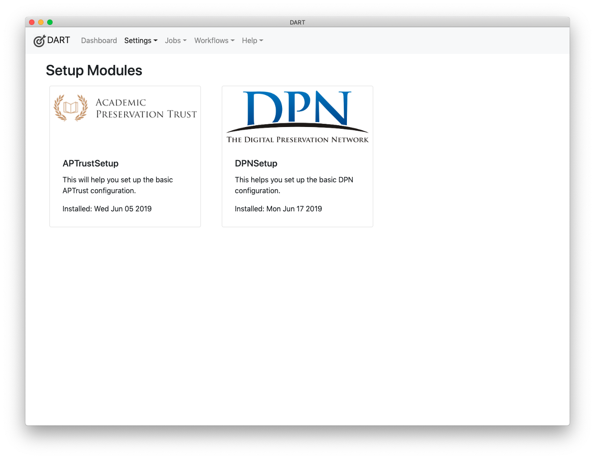

# Setup Modules

WARNING - Setup Modules will soon be deprecated in favor of a much simpler system of importing and exporting settings. The import/export feature should be complete in February, 2020.

Setup modules ease the process of configuring DART for users who will require common settings. These modules allow a developer or organization to:

* Automatically install a number of default settings.

* Walk the user through a series of simple questions to help them finish the configuration.

For example, a setup plugin could do the following for your organization or user group:

* Install BagIt profiles.

* Install pre-configured [StorageService](../../users/settings/storage_services.md) objects that include common information such as the URLs and protocols needed to connect.

* Install pre-configured [RemoteRepository](../../users/settings/remote_repositories.md) objects that include common information such as the URLs and protocols needed to connect.

After silently installing these objects, the walk-through questions can ask users for their specific login names and passwords to fill out the remaining information required to make the storage services and remote repositories usable.

The process of automated configuration followed by simple questions is easier and less error-prone than processes that require users to search out a number of setting options and then fill out many fields. Setup modules have the added benefit of being repeatable. If a user's credentials have changed and he/she doesn't know which settings to update, they can go through the setup process again, enter their credentials where prompted, and the setup plugin will store them in the correct place.

## API

Setup plugins must extend the [SetupBase](https://aptrust.github.io/dart/SetupBase.html) class, which implements all of a setup plugin's required methods, and also defines the following optional methods, which your plugin can override:

* [afterAllQuestions](https://aptrust.github.io/dart/SetupBase.html#afterAllQuestions) - A callback invoked after a user has provided valid answers to all questions.

* [afterEachQuestion](https://aptrust.github.io/dart/SetupBase.html#afterEachQuestion) - A callback invoked after a valid answer to each question.

* [beforeAllQuestions](https://aptrust.github.io/dart/SetupBase.html#beforeAllQuestions) - A callback invoked before the first question is presented to the user.

* [beforeObjectInstallation](https://aptrust.github.io/dart/SetupBase.html#beforeObjectInstallation) - Invoked before the [SetupController](https://aptrust.github.io/dart/SetupController.html) installs objects from JSON files.

    !!! tip "Read the Source"
        Take some time to review the source of [SetupBase](https://github.com/APTrust/dart/blob/master/plugins/setup/setup_base.js) to see what features it provides.

## Supporting Files

Your setup module may include any or all of the following files. These files should be placed in folder beside your plugin, with a name that matches your plugin (minus the .js extension). For example, the [APTrust setup plugin](https://github.com/APTrust/dart/blob/master/plugins/setup/aptrust.js) is in `plugins/setup/aptrust.js` and its [supporting files](https://github.com/APTrust/dart/tree/master/plugins/setup/aptrust) are in `plugins/setup/aptrust/`.

Note that you should generate a UUID to identify each item you install from the JSON files below, and any custom code that manipulates those items should refer to objects by their UUID. For example, see the [storage services](https://github.com/APTrust/dart/blob/master/plugins/setup/aptrust/storage_services.json) that the APTrust plugin installs and the source code of the [_setBucketNames](https://github.com/APTrust/dart/blob/master/plugins/setup/aptrust.js) method that manipulates the records after they've been installed.

Your setup module can install partially configured objects whose incomplete properties are filled in later based on user responses. Again, see the [_setBucketNames](https://github.com/APTrust/dart/blob/master/plugins/setup/aptrust.js) method of the APTrust setup plugin.

Objects from each of the JSON files listed below will be installed before the user sees the first question in your setup module. All of the following files are optional.

### app_settings.json

This file contains [AppSetting](https://aptrust.github.io/dart/AppSetting.html) records to be installed at the beginning of the setup process. Example: [app_settings.json](https://github.com/APTrust/dart/blob/master/plugins/setup/aptrust/app_settings.json).

### bagit_profiles.json

This file contains [BagItProfile](https://aptrust.github.io/dart/BagItProfile.html) objects to be installed. Example: [bagit_profiles.json](https://github.com/APTrust/dart/blob/master/plugins/setup/aptrust/bagit_profiles.json).

!!! warning "BagIt Profile Differences"
    DART BagIt profiles differ somewhat from the standard BagIt profiles found in the GitHub bagit-profiles repo. The differences are described [here](../../users/bagit/index.md). We're working on code to translate between the two formats. For now, you can [define DART BagIt profiles](../../users/bagit/creating/) using the DART UI.

### end_message.html

This file contains the message the user will see upon completing the setup process. This file can contain any valid HTML.

### internal_settings.json

This file contains [InternalSetting](https://aptrust.github.io/dart/InternalSetting.html) records to be installed at the beginning of the setup process. Example: [internal_settings.json](https://github.com/APTrust/dart/blob/master/plugins/setup/aptrust/internal_settings.json).

### logo.png

A logo to be displayed in your setup module. This will appear on the list of available setup modules, as in the image below.

### questions.json

This file contains a list of questions that will be presented one at a time to the user. Each question is a JSON representation of a [SetupQuestion](https://aptrust.github.io/dart/SetupQuestion.html) object.

The DART [SetupController](https://aptrust.github.io/dart/SetupController.html) will present these questions in the order they appear in the JSON file. DART copies responses to questions into specific properties of objects installed by your setup module. Read the documentation and example for the `mapsToProperty` attribute of the [SetupQuestion](https://aptrust.github.io/dart/SetupQuestion.html) object for details.

Example: [questions.json](https://github.com/APTrust/dart/blob/master/plugins/setup/aptrust/questions.json)

### remote_repositories.json

This file contains one or more [RemoteRepository](https://aptrust.github.io/dart/RemoteRepository.html) objects to be installed. Note that if your repository includes more than one environment (e.g. demo and production) you should include one object for each environment, since they will have different URLs and different login credentials.

You probably won't want to include user credentials with these objects, but DART can fill in the userId and apiToken fields based on user responses to your questions. See the questions `q_aws_demo_secret_key` and `q_pharos_demo_login` in the [APTrust setup questions](https://github.com/APTrust/dart/blob/master/plugins/setup/aptrust/questions.json). Each includes a `mapsToProperty` object that tells DART to copy the user's response into a specific field of a specific object.

Example: [remote_repositories.json](https://github.com/APTrust/dart/blob/master/plugins/setup/aptrust/remote_repositories.json).

### start_message.html

The HTML of the message the user will see when they launch your setup plugin.

### storage_services.json

This file contains [StorageService](https://aptrust.github.io/dart/StorageService.html) objects to be installed. Storage services are network-accessible drop-off points for ingests and/or pick-up points for restorations.

Example: [storage_services.json](https://github.com/APTrust/dart/blob/master/plugins/setup/aptrust/storage_services.json)

## Mechanism

If you're curious about how setup plugins are run, see the [SetupController documentation](https://aptrust.github.io/dart/SetupController.html) and [SetupController source](https://github.com/APTrust/dart/blob/master/ui/controllers/setup_controller.js).
