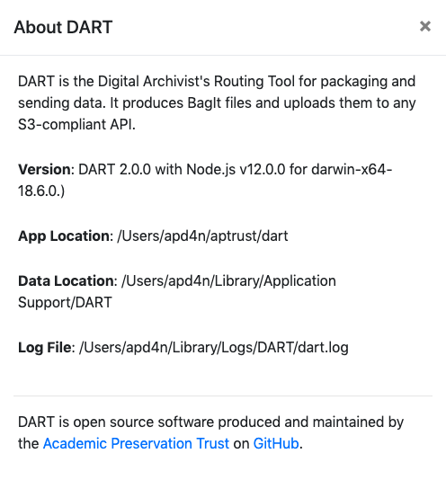

# About

DART is the Digital Archivist's Resource Tool. It provides both a GUI and command line interface for packaging files and sending them off to remote repositories.

## About Your Dart Version

DART's About dialog shows information about DART, including the application version, and the location of the executable, the log files, and the data files. To display it, click <b>Help &gt; About</b> on the main menu.

You should see something like this:

