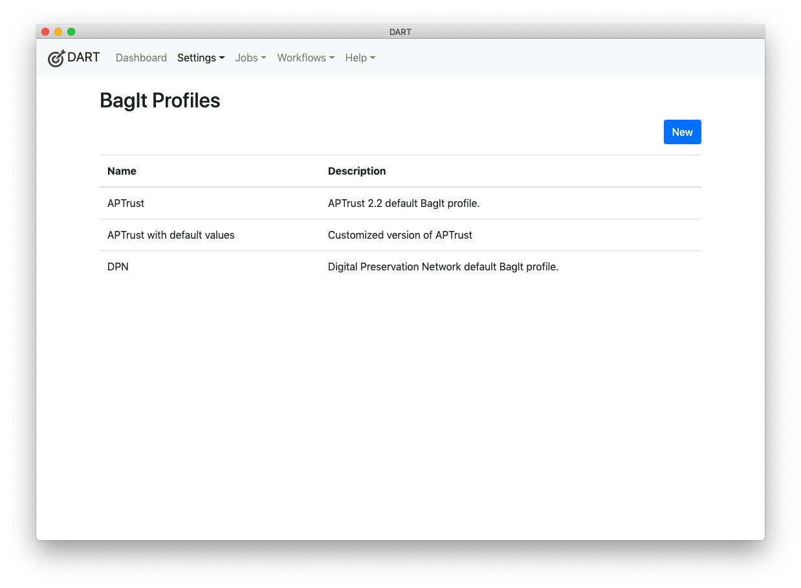
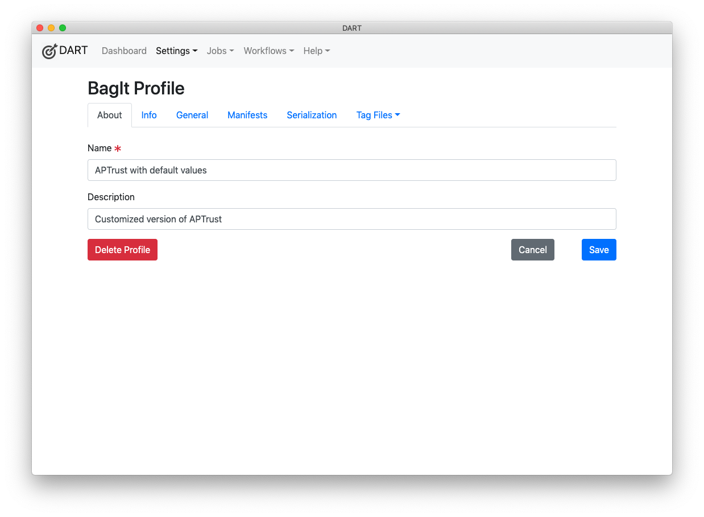
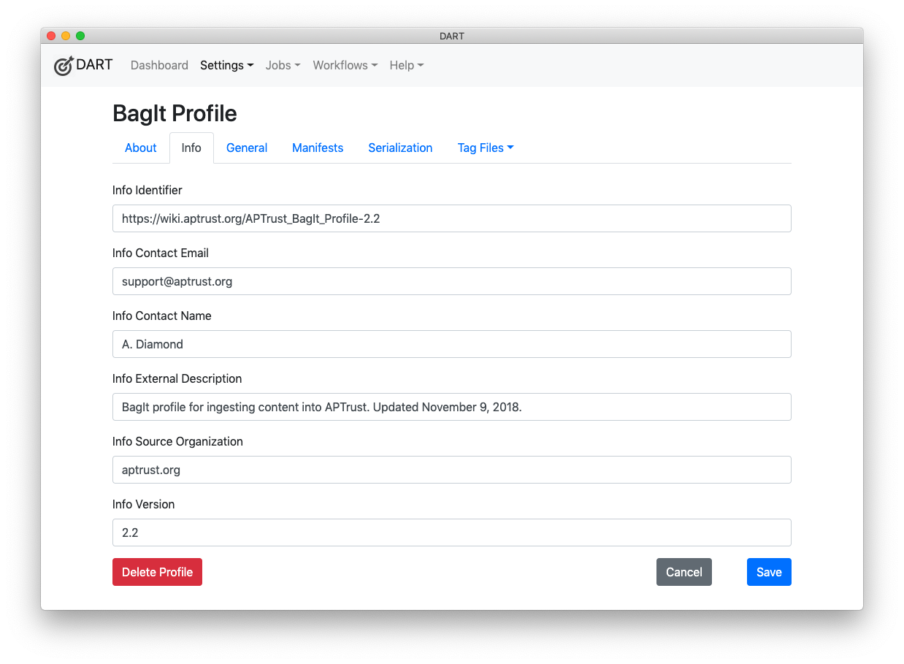
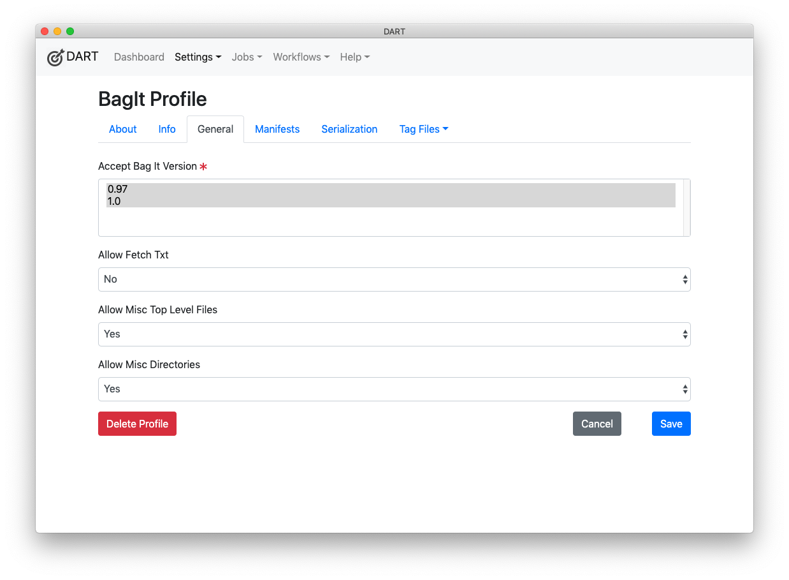
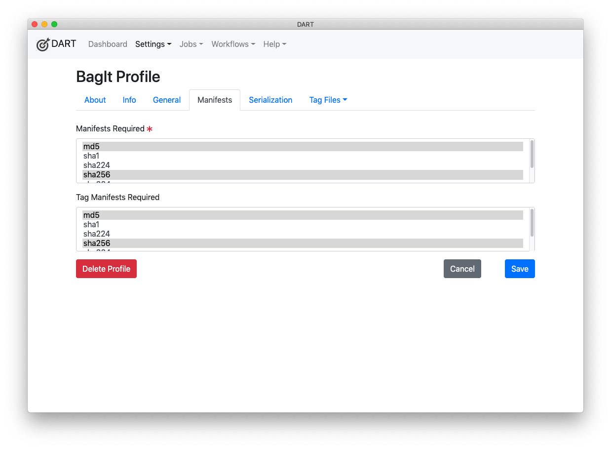
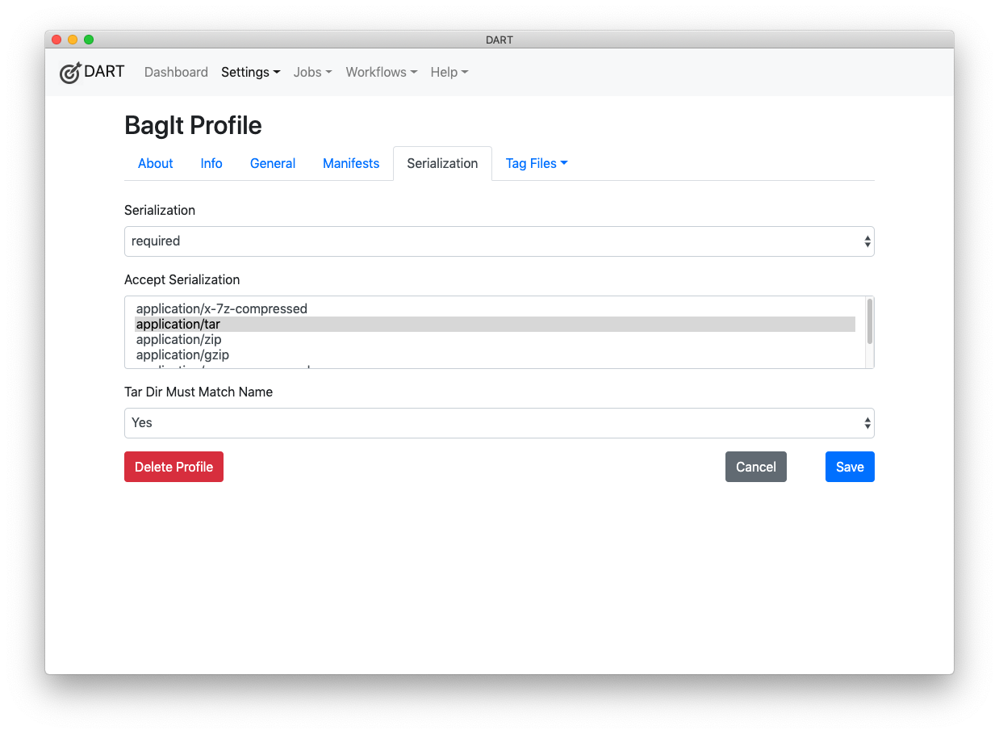
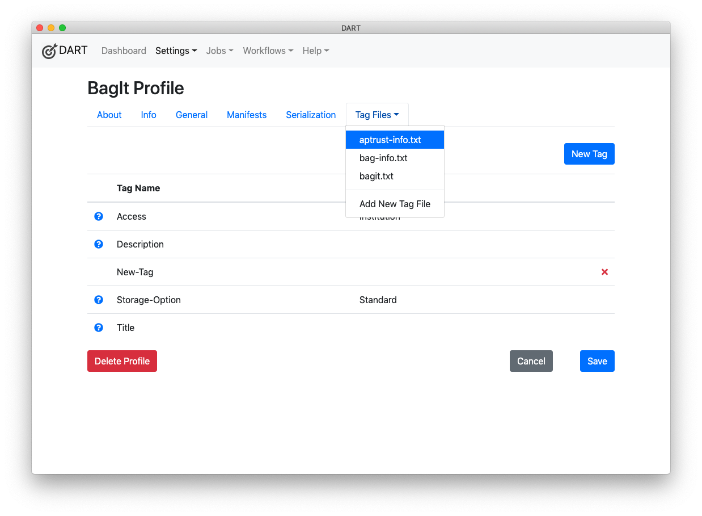
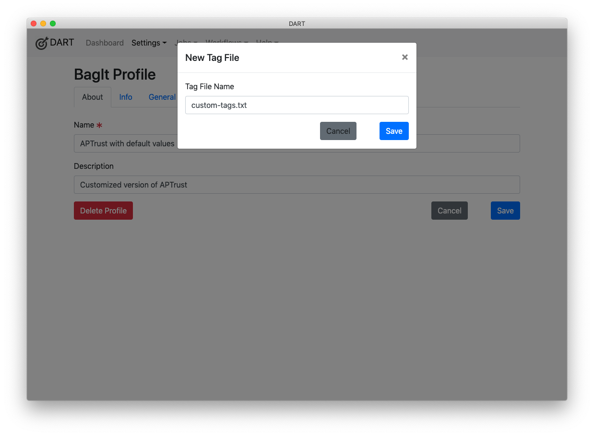
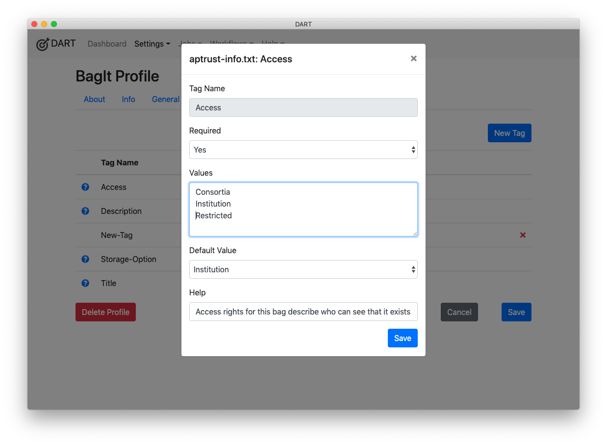
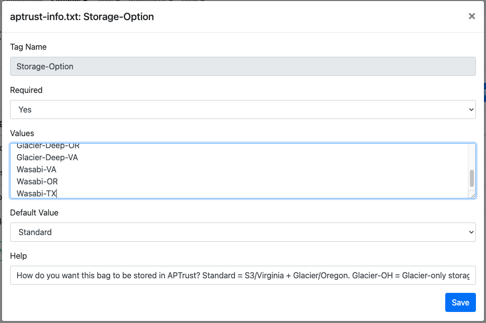

# Customizing Profiles

To customize a BagIt profile, click the name of the profile in the profiles list, or click new and follow the steps to [create a BagIt profile](creating.md).

## About

The About tab of the BagIt profile editor enables you to set a name and description for your profile.

## Info

The Info tab includes fields to edit the BagIt-Profile-Info section of the profile. This includes the profile's URL identifier.

## General

The General tab includes information about which BagIt versions your profile accepts, whether to allow fetch.txt files, and whether to allow miscellaneous top level files (arbitrary tag files directly under the root directory) and miscellaneous directories outside the payload (/data) directory.

## Manifests

The Manifests tab specifies which manifests and tag manifests your profile requires. You can select multiple options from each list by holding down the Control key on Windows or the Command key on Mac while you click.

## Serialization

The Serialization tab allows you to specify whether serialization is required, optional, or forbidden, as well as which serialization formats are supported. You can also specify here whether serialized bags must deserialize to a directory whose name matches the serialized file name. (For example, my_bag.tar must untar to my_bag and my_bag.zip must unzip to my_bag.)

## Tag Files

The Tag Files tab includes a drop-down list for editing the profile's tag files, and for adding new tag files.

### Adding a New Tag File

To add a new tag file:

1. Click __Add New Tag File__ on the drop-down list.

1. Enter a name for the tag file. If the name includes slashes, the tag file will be created in a subdirectory beneath the bag's root directory. For example, `custom-tags/photo-credits.txt` would be placed in the bag's custom-tags directory.

1. Click the __Save__ button.

### Editing a Tag File

To edit a tag file:

1. Click the __Tag Files__ tab.

1. Select the name of the file you want to edit.

#### Adding a Tag

To add a tag to a tag file, click the __New Tag__ button (visible in the screenshot above), then follow the steps in Editing a Tag below.

#### Editing a Tag

To edit a tag:

1. Click the name of the tag you want to edit.

1. Set the appropriate values in the dialog.

    1. Tag Name - The name of the tag. This is required.

    1. Required - A Yes/No value indicating whether the tag must have a value
       for the bag to be considered valid.

    1. Values - An optional list of allowed values for this tag.

    1. Default Value - An optional default value for this tag.

    1. Help - An optional help message. This message will be displayed to
       users who are filling out a bag's tag values in DART.

1. Click the __Save__ button.

#### Deleting a Tag

To delete a tag, click the red X to the right of the tag name in the tag list view. If the tag does not have a red X, it is a required tag from a published profile and cannot be deleted. When you delete the last tag of a tag file, DART deletes the tag file as well.

### Deleting a Tag File

To delete a tag file, delete all of the tags in the file. See [Deleting a Tag](#deleting-a-tag) above.

### Adding the Wasabi-TX Storage Option

As of April, 2023, APTrust can store objects in Wasabi's Texas datacenter. This storage option is not listed in version 2.2 of the APTrust BagIt profile. Follow these steps to add it, so you can send bags to the beautiful state of Texas!

1. Click **Settings > BagIt Profiles** from the top menu.
2. Click the APTrust profile. It should have the name **APTrust** and description **APTrust 2.2 default BagIt profile.**
3. From the tab menu, choose **Tag Files > aptrust-info.txt**
4. In the list of tags, click **Storage Option**.
5. Scroll to the bottom of the **Values** box and press Enter to add a new line.
6. Type **Wasabi-TX** into the **Values** box. Be sure the capitalization matches. W, T, and X should be capitalized, with a dash before the TX, as in the screenshot below.
7. Click **Save**.

The next time you create a bag using the APTrust BagIt profile, you will be able to choose Wasabi-TX as the storage option.
