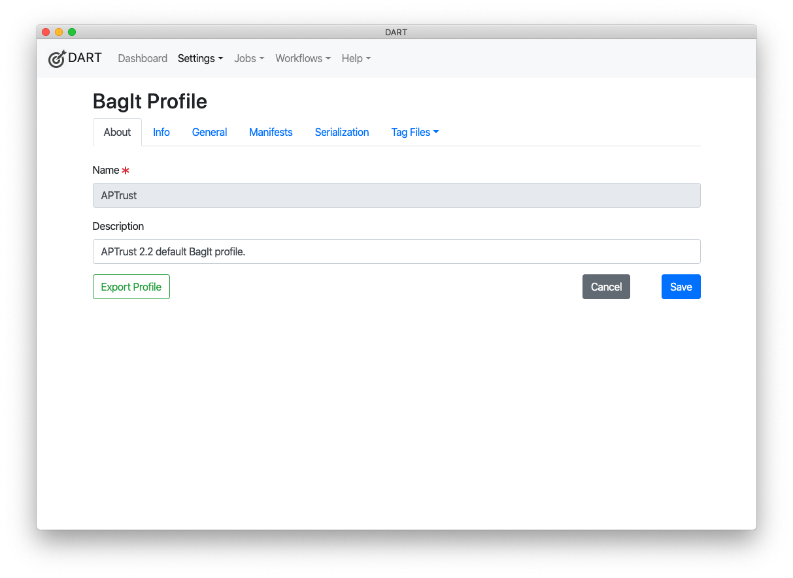
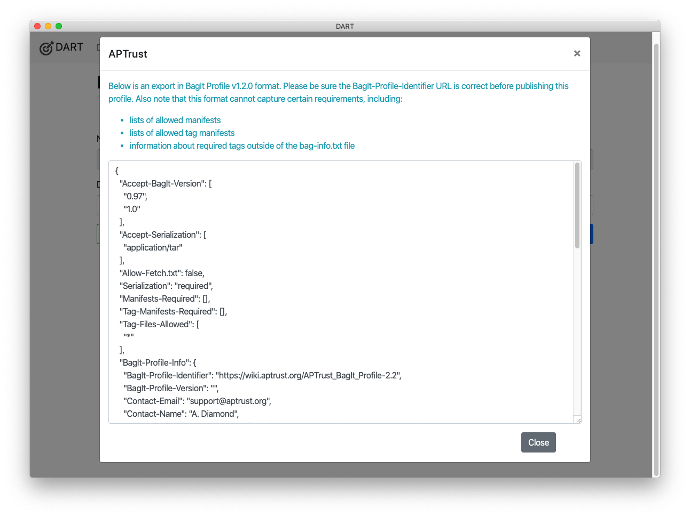

# Exporting Profiles

DART can export profiles to the [BagIt Profiles 1.3 specification](https://bagit-profiles.github.io/bagit-profiles-specification/), though note that that specification does not support validation of tags outside the bagit.txt and bag-info.txt files. When exporting a DART profile to the 1.3 specification format, you will lose information describing how to validate tags outside of those files.

To export:

1. Choose __Settings > BagIt Profiles__ from the main menu.

    

2. In the profile list, click the profile you want to export.
3. Click the __Export Profile__ button at the bottom right of the profile detail page.

   

4. Copy and paste the exported JSON into a file of your choice.

   

Note the instructions at the top of the export page. If you plan to publish the exported profile, be sure to set the correct profile URL. When a BagIt validator tries to validate bags created with this profile, it will try to fetch the profile from the URL. If the URL is incorrect, validation will fail.
