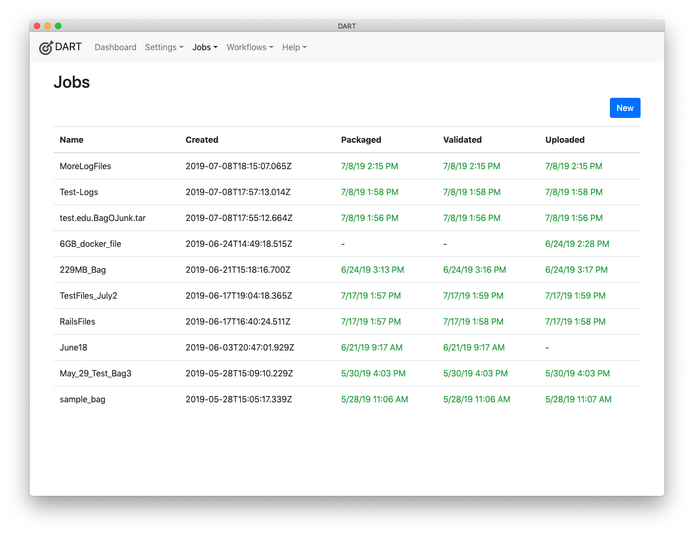

# Listing Jobs

To list all jobs, Choose __Jobs &gt; List__ from the menu. The list shows the job name and information about when it was last packaged, validated, and/or uploaded.

Click on any job in the list to view it. On the following screen, you'll be able to edit or delete the job.

