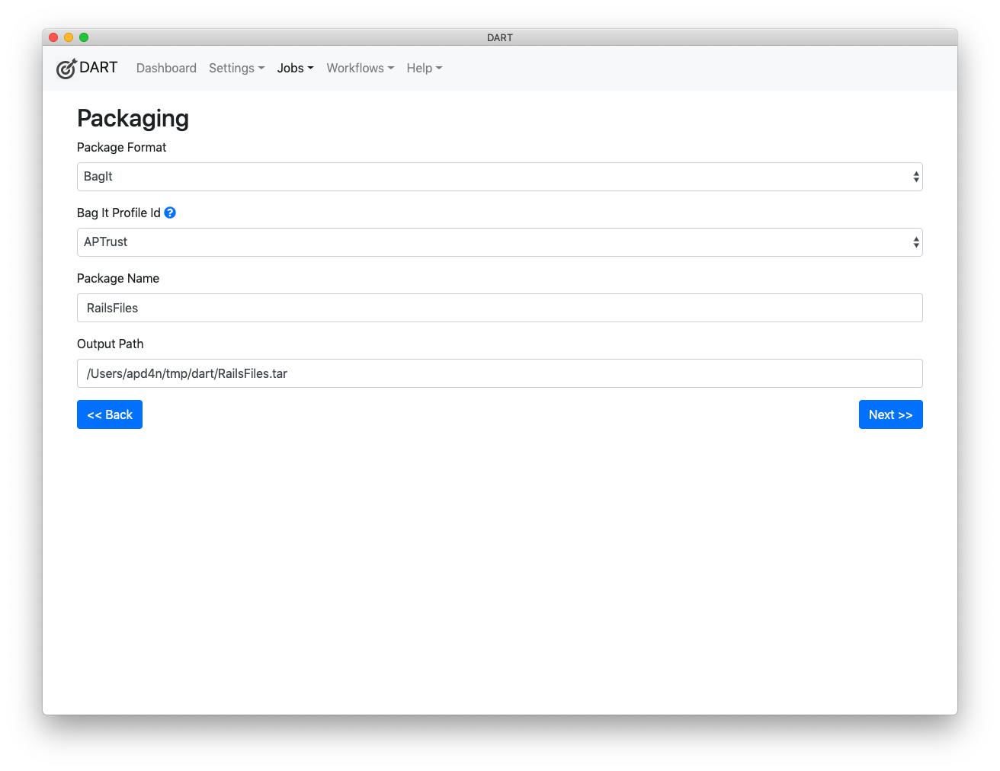

# Metadata

You'll see the job metadata screen if you chose the BagIt packaging format on the previous screen. This screen allows you to enter values for tags that will go into BagIt tag files. By default, this screen only shows tags whose values are not already filled in by default values.

Default values come from two places:

* Default tag values you've entered into your local BagIt profiles. See the [Editing a Tag](../bagit/customizing/#editing-a-tag) section for information about setting default values.

* Auto-filled values calculated by DART when it creates the bag, such as the Payload-Oxum, Bagging-Software, and Bagging-Date.

If you want to edit tags with pre-set default values, click the __Show All Tags__ button in the top right corner of the page.

## Adding Custom Tags

You can add a custom tag to a bag by clicking the __Add New Tag__ button at the top of the page. Note that adding extra tags to a bag generally will not cause the bag to be invalid. The only exception to this rule is adding tags that the BagIt specification says may not be repeated, such as the Payload-Oxum tag.
