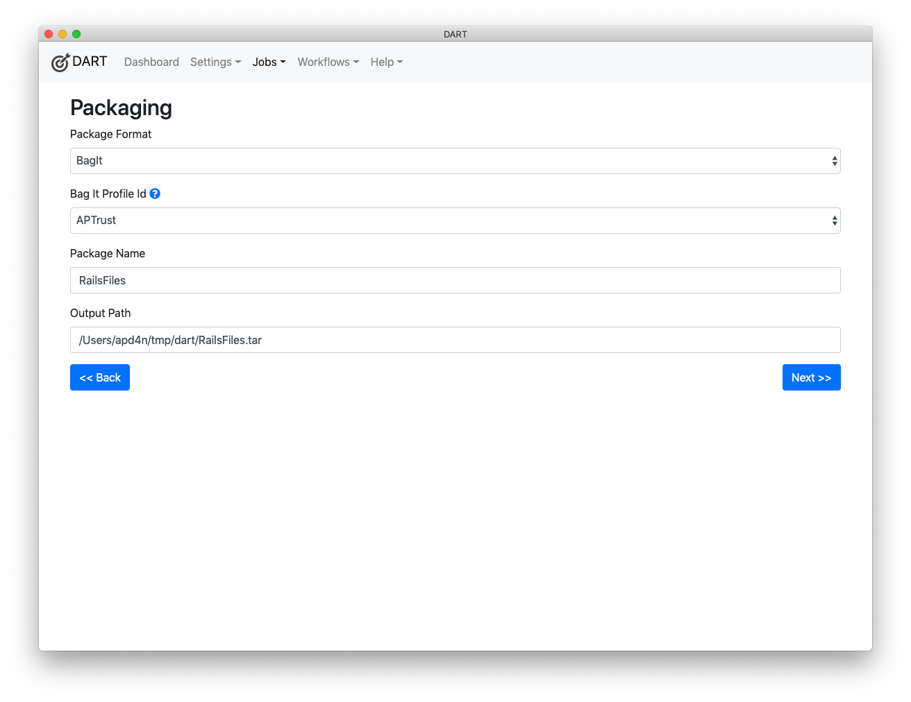

# Packaging

The packaging screen incudes the following options:

* Package Format - Choose how you want your files to be packaged. The following options are available:

    * BagIt - Choose this if you want to bag your files in BagIt format.

    * Tar - Choose this if you want to pack your files into a single tar file.

* BagIt Profile - This option appears when you choose BagIt as the package format. Note that you can have structurally identical BagIt profiles with different sets of default values. See [Creating BagIt Profiles](../bagit/creating.md) for more information.

* Serialization - Choose whether you want the bag to be serialized to tar format. We expect to support additional options in the future, including zip, gzip and others.

* Package Name - Type the name of the package you want to create. DART will create a package with this file name. Note that some repositories, including APTrust*, have required naming conventions, and most discourage the use of non-printable characters in package names.

* Output Path - This is where DART will put the local copy of the package that it builds. Notice that this field is filled in automatically as you type the package name. Unless you have good reason, you should not manually edit this field.

*APTrust bag names should begin with your organization identifier, followed by a dot and a unique name. For example, virginia.edu.photos-2019-07-21.
