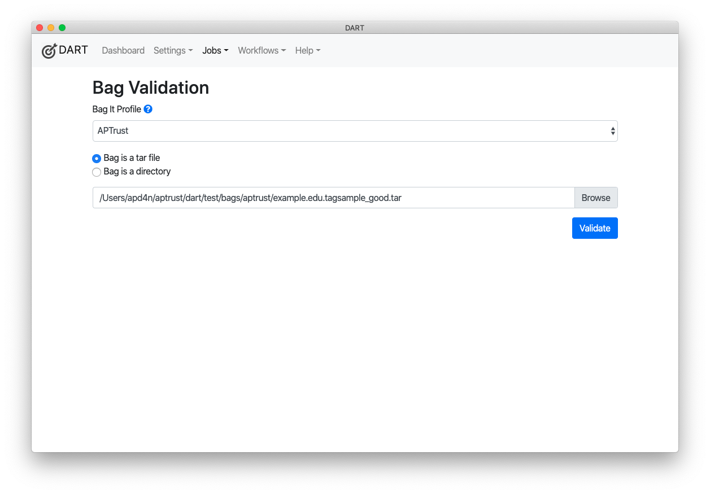
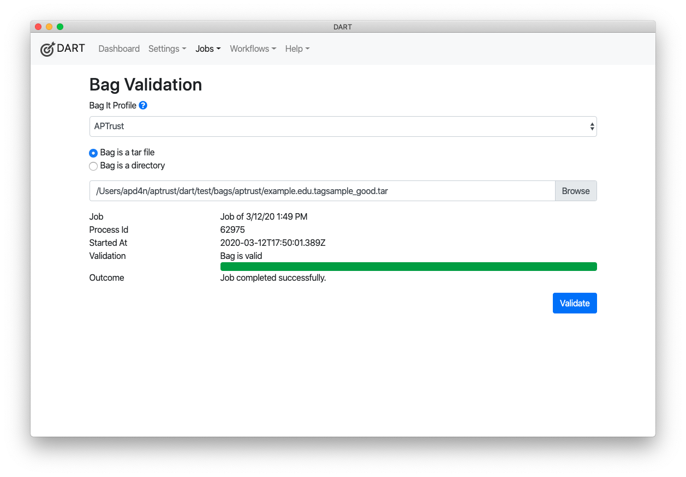

# Validation Jobs

If you simply want to validate an existing bag, follow these steps:

1. Choose __Jobs &gt; Validate a Bag__ from the menu.

1. Choose the BagIt profile against which you want to validate. If you want to validate against the BagIt specification instead of a specific profile, choose the "Empty Profile."

    

1. Choose whether you want to validate a tarred or untarred bag. As of version 2.0.4 (March, 2020), DART supports only tarred and unserialized bags (i.e. a bag that is a folder). We plan to support additional formats in the future.

1. Click __Browse__ to choose the folder or tar file you want to validate.

1. Click __Validate__.

    

The progress bar will show the progress of the job, and DART will display specific error messages below the progress bar when the job is complete.

Note that a bag that is valid according to one profile may be invalid according to others. If a bag is valid according to the Empty Profile, it conforms to the general <a href="https://tools.ietf.org/html/rfc8493" target="_blank">IETF BagIt specification</a>.
