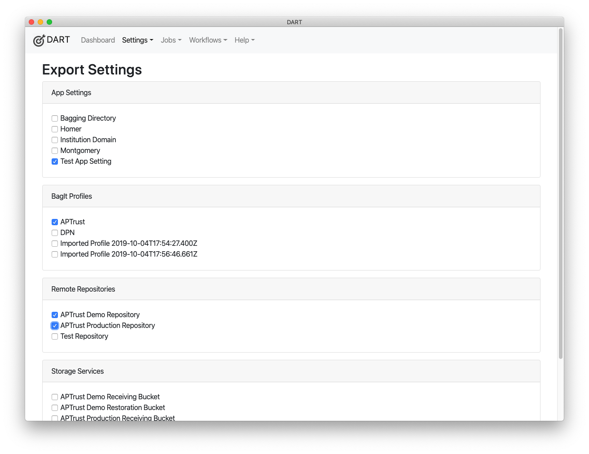
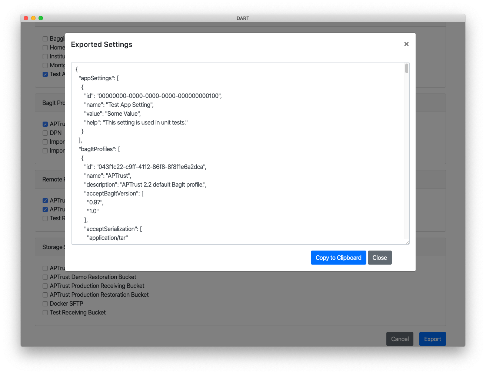
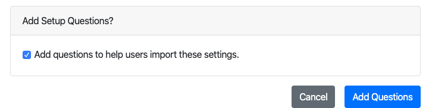
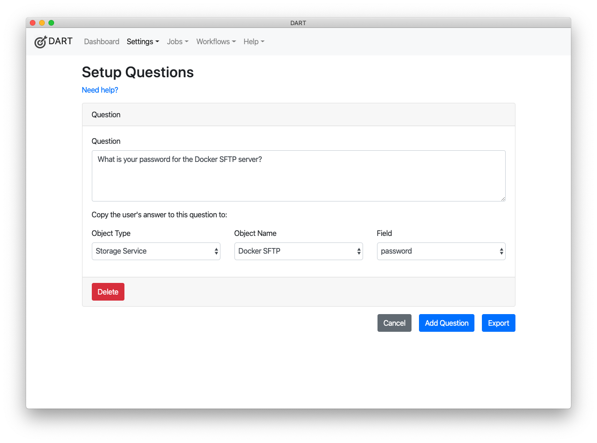

# Exporting Settings

If you're setting up DART for a number of users, you may want to configure your local DART installation, then export your settings for others to use. For example, you can set up a BagIt Profile, application settings, remote repositories and storage services for your institution, then publish them to a URL for others to install via DART's import feature.

!!! note "Data Export Does Not Export Credentials"

    When you export StorageService and RemoteRepository records, DART will not export login and password fields, unless they begin with "env:", which indicates the logins/passwords are to be loaded from the environment.

    You may still export these records, but you will then have to pass login and password information through another channel, such as phone, email, or <a href="https://privnote.com/#" target="_blank">PrivNote</a>.

    Also note that if you export StorageService and RemoteRepository records and then import them back into your own DART installation, you may overwrite the records' existing login and password info with blank data.

To export settings from DART:

1. Choose __Settings > Export Settings__ from the main menu.
2. Check the boxes next to the settings you want to export.
3. Click __Export__.

After exporting your settings, click __Copy to Clipboard__ to copy them.

You can then post the settings to a public URL, or email them to other users for import.

## Export Questions

If you are exporting settings for a number of other users, you may want to add questions to your export, to help walk users through the setup process.

Because settings are meant to be published and shared, DART does not export login names and passwords. You should pass those by phone, PrivNote, or some other secure channel.

You can define questions that will prompt the user for that information and DART will copy the user's response to the setting and field you define. For example, you can ask a user to enter their SFTP password and tell DART to copy into the connection settings for your SFTP server.

DART can also copy values into the default value fields of BagIt profile tags. For example, if your BagIt profile includes an "Internal-Department" tag, user can enter their department name in response to a question and have the response become the default value for all bags they produce.

To define setup questions:

1. Check the box next to _Add questions to help users import these settings._
1. Click the __Add Question__ button on the bottom of the Settings Export screen.
    
1. Type in your question. For example, "What is your password for the sftp server?"
1. Tell DART to copy the user's response into the password field of the Storage Service called "SFTP demo server".

