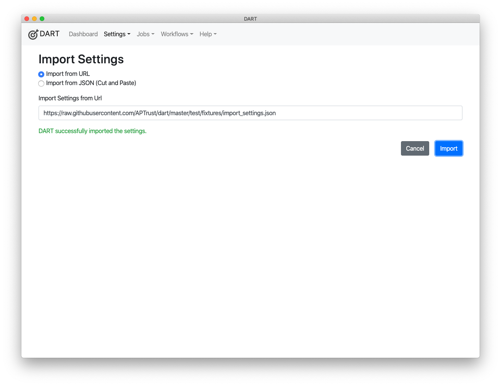
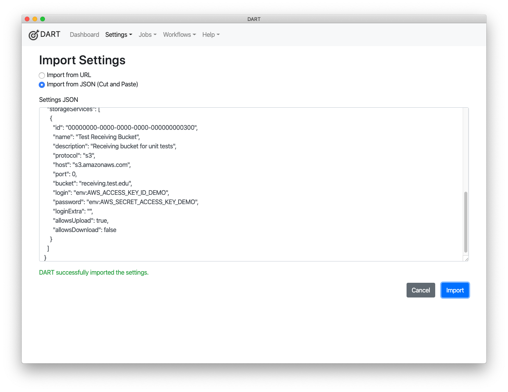

# Importing Settings

You can import settings into DART from a URL or by copying and pasting data. DART's data import feature helps organizations configure and distribute basic settings for their users.

!!! note "Data Export Does Not Export Credentials"

    By default, DART will not export login and password fields. When sharing settings, DART's import feature will pull in most of the data you need. However, you will have to get login and password information through another channel, such as phone, email, or <a href="https://privnote.com/#" target="_blank">PrivNote</a>.

To import settings, follow these steps:

1. Choose __Settings > Import Settings__ from the menu.
2. Choose whether to import settings from a URL or from copy-and-paste text.
    * If you choose URL, enter the URL in the text box.
    
    * If you choose "Import from JSON", paste the JSON into the text area.
    
3. Click __Import__.
