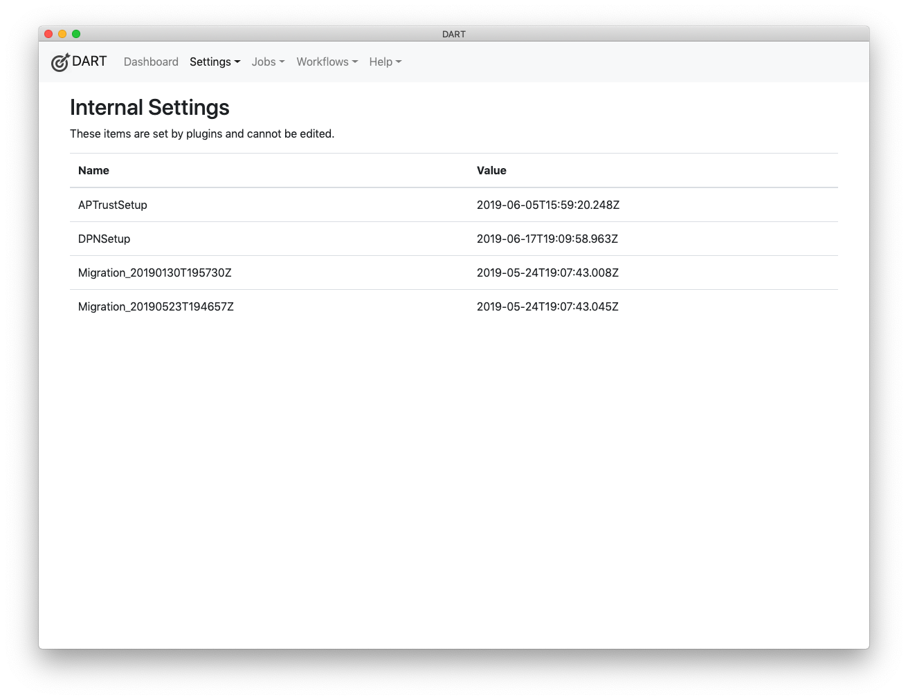

# Internal Settings

Internal Settings contain configuration information that users cannot edit. These settings are created by plugins, setup packages, and software updates. Though you cannot change them, knowing their values may be helpful to DART users and developers.

