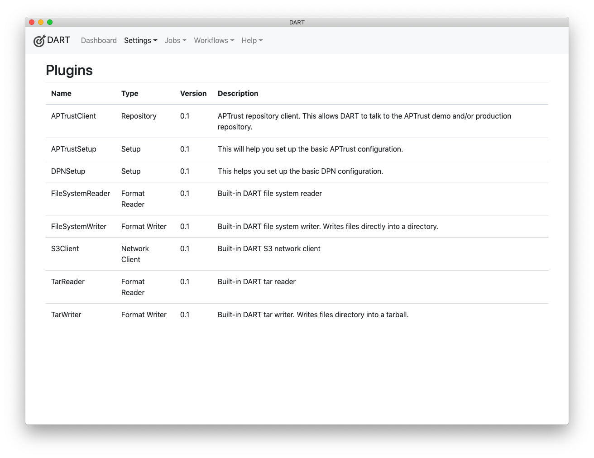

# Plugins

DART plugins provide features such as the following:

* __Format Reader__ - Allows DART to read files packaged in a certain format, such as tar.

* __Format Writer__ - Allows DART to write files into specific formats, such as tar.

* __Network Client__ - Allows DART to communicate via certain network protocols, such as S3, so that it can upload and/or download files.

* __Repository__ - Allows DART to communicate with remote repositories to retrieve information such as a list of ingested objects.

To see the list of plugins installed on your system, choose __Settings &gt; Plugins__ from the menu. You should see a list like this:

See also: [Plugins documentation for developers](../../developers/plugins/index.md)