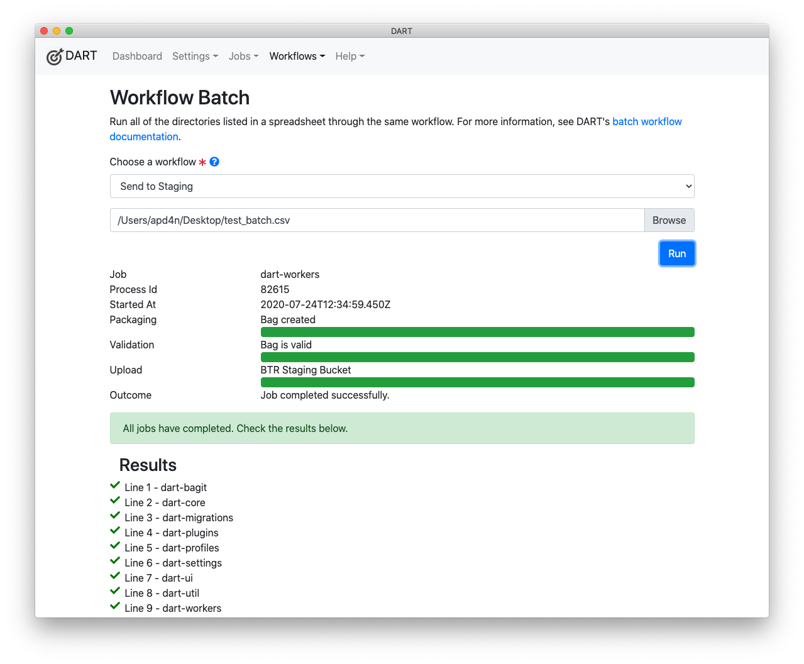

# Batch Jobs

Batch jobs allow you to define a series of jobs in a spreadsheet and then run all of the jobs through the same workflow. Note that a [workflow](./index.md) typically includes a BagIt profile, often with default tag values already filled in, and one or more upload targets.

When you run a batch of jobs through a workflow, all steps of that workflow are
applied to every item in the batch. For example, that could mean bagging up
1000 directories using the APTrust BagIt profile and sending them all to APTrust's
demo or production environment.

Batch jobs are not limited to APTrust. Your bags can conform to any BagIt profile
and be uploaded to any SFTP or S3-compliant server.

## Batch Spreadsheet Requirements

Your spreadsheet must meet the following requirements:

1. The first line __must__ contain column names.
1. The sheet __must__ contain the following columns:
    * __Bag-Name__ - The name of the bag you wish to create.
    * __Root-Directory__ - The absolute path to the directory containing the files
      you want to bag.
1. You __must__ include one column for each required tag in tag in your workflow's
   BagIt profile. The column header for each tag __must__ be in the format
   `tag_file_name.txt/tag-name`. For example, `bag-info.txt/Source-Organization`,
   or `aptrust-info.txt/Storage-Option`.
1. Your file _may_ omit tags whose default values are already defined in your BagIt
   profile. (See [Customizing a Tag](../bagit/customizing/#editing-a-tag) for
   more info on how to set default tag values in your bagging profiles.)
1. Your file _may_ include extra tags not defined in your workflow's BagIt
   profile. For example, if you include a column named `bag-info.txt/Custom-Tag`,
   DART will add the tag `Custom-Tag` to the `bag-info.txt` file of each bag,
   along with the value specified in that bag's row. Adding
   `custom-tag-file.txt/My-Tag` will cause DART to create a tag file for each
   bag called `custom-tag-file.txt` and add `My-Tag` to it, along with the
   appropriate value.
1. You __must__ save your spreadsheet as a CSV (comma separated value) file so
   DART can read it. Both Microsoft Excel and Google Sheets can export to CSV
   format.

### Example Spreadsheet

The sample spreadsheet below defines a batch job to bag up DART source files.
Note that it includes definitions for tags required by the APTrust BagIt profile,
including the Source-Organization tag in bag-info.txt and the Title, Description,
Access, and Storage-Option tags in aptrust-info.txt.

Use the right and left arrow keys to scroll sideways in the sheet. You'll see a
custom tag at the end called `bag-info.txt/Custom-Tag`. This tag is not defined
in any BagIt profile, but DART will add it to all the bags in the batch and the
bag will still be valid because BagIt profiles define only what __must__ be
present and do not prohibit what __may__ be present.

<iframe src="https://docs.google.com/spreadsheets/d/e/2PACX-1vT4ZZGsqtba_id15vlLVo0IlS3WND65Ty5A6nD5sDfmO97LJEa5pIwlsKvLazfG97MxyYMVR2Ry4Put/pubhtml?gid=710855240&amp;single=true&amp;widget=true&amp;headers=false" width="100%" height="300"></iframe>

## Running a Batch Job

1\. Choose __Run Batch__ from the __Workflows__ menu.

2\. Select a Workflow from the list and choose a CSV file. The image below
shows the `Send to Staging` workflow and the CSV file `/Users/apd4n/Desktop/test_batch.csv`.

3\. Click the __Run__ button. DART will show the progress of each job as it runs,
and will show the outcome of each job as it completes. In the image below, all
nine jobs completed successfully.

## Notes on Batch Jobs

1. DART runs each job in a batch as a separate process.
1. DART runs jobs one at a time because bagging involves a lot of disk reads
   and writes.
1. If you try to run a job with an invalid workflow, or your CSV file points
   to directories and files that don't exist, DART will display the errors
   and will not run the batch.
1. Individual jobs within the batch may fail. The most common reason for failure
   is lack of file permissions on one or more files to be bagged. If a job fails,
   DART will display the reason for failure and will continue running the other
   jobs in the batch.
1. You must stay on the Workflow Batch screen until all jobs in the batch are
   complete. If you navigate away from that screen, DART will complete the
   currently-running job but will not run the remaning jobs in the CSV file.

## Common Problems

1. DART complains about missing or empty values in the CSV file.

    First, make sure the values are actually present in the file.

    Excel sometimes exports a number of empty rows at the end of a CSV file.
    If DART complains about missing values, open the CSV file in a text editor
    and delete the empty rows. These often appear as lines containing nothing
    but commas.

1. DART says required tag values are missing, but they appear to be in the
   CSV file.

    Make sure the column headers are correct. A common error is to have headers
    like `bag-info/Source-Organization` instead of
    `bag-info.txt/Source-Organization`. The `.txt` is required to match the
    tag from the CSV file to the tag in your workflow's BagIt profile.
    You should also ensure that capitalization and hyphenation match.

1. DART says a job failed because of `EACCESS Cannot read <some file>`.

    Check the file permissions on the file DART complained about. Although
    you may have read permissions on most of the files you're trying to bag,
    you may be lacking permissions on one or two. That's enough to cause the
    job to fail. If you're bagging files from a shared network drive, you
    may have to ask a system administrator for help in setting file permissions.

!!! Note
    Batch jobs are new in DART 2.0.9 (released July 24, 2020). If you find bugs,
    please report them to
    the [DART GitHub repostory](https://github.com/APTrust/dart/issues) or to
    <help@aptrust.org>.
