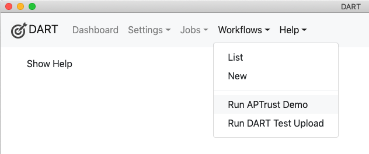
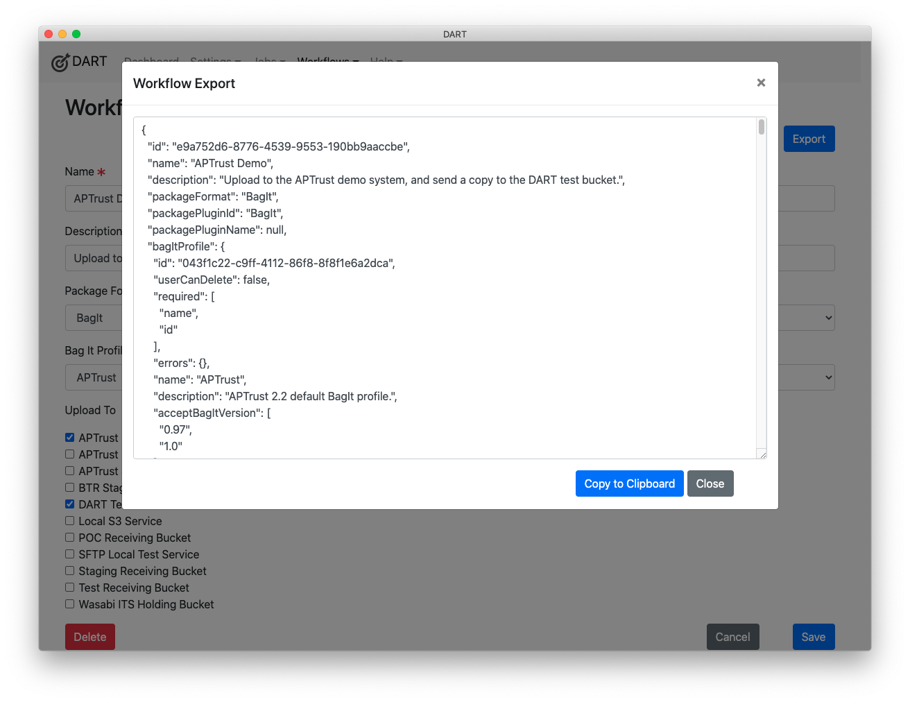

# Workflows

A workflow is a set of packaging, validation, and/or upload operations that you define as a template to be run on any sets of files you choose.

Workflows ensure that the exact same set of steps is run on each set of files. DART can run workflows from the UI and from the command line, which means you can create scripts that use workflows to package and upload materials.

!!! note
    DART won't run on servers that don't have graphics because DART's
    underlying Electron framework insists on graphics capabilities
    even when running in command-line mode.

    DART Runner **does** run on servers. For more info, see
    the [DART Runner page](/users/dart_runner/).

## Defining a Workflow

DART provides two ways to define a workflow: from a job or from scratch.

### Creating a Workflow from a Job

The easiest way to create a workflow is to first [create a job](../jobs/index.md) that includes all of the operations you want to include, run the job to ensure it works, then click the [__Create Workflow__](../jobs/run/#creating-a-workflow-from-a-job) button on the __Review and Run__ screen.

### Creating a Workflow from Scratch

To create a workflow from scratch:

1. Choose __Workflows &gt; New__ from the menu.

1. Fill in the details.

    1. The __Name__ is required and should describe what the workflow will do. This name will appear on the Workflow menu, and scripted tasks will use this name to reference the workflow. (See #2 under [Tips for Workflows](#tips-for-workflows) below.)

    2. The __Description__ is for your internal use.

    3. Choose the __Package Format__ that suits your needs.

    4. If you chose BagIt as the Package Format, choose which __BagIt Profile__ you want to use to build the bag. (See #1 under [Tips for Workflows](#tips-for-workflows) below.)

    5. Choose the destination to which you want to upload the packaged files. Note that only [Storage Services](../settings/storage_services/) where _Allows Upload_ is set to _Yes_ will appear in the __Upload To__ list.

    6. Click __Save__, and remember that you can edit or delete this workflow later.

## Tips for Workflows

1. Use customized BagIt profiles. DART lets you clone the base version of a BagIt profile and then add your own tag default values, so that you don't have to re-enter those values each time you create a new bag. For example, most BagIt profiles require a value for the Source-Organization tag, and typically, this value will be the same for every bag you create. Most profiles also require a number of other tags that may rarely or never change from bag to bag. For example, most depositors will set the same Access and Storage-Option values for 99% of the bags they upload to APTrust. Including in your workflow a custom BagIt profile with pre-set default values will save you having to re-enter common tag values, while still allowing you to override them when necessary.

2. Use meaningful names for your workflows. Many repositories include both a staging environment and a production environment. You may create workflows that are identical except that one pushes packages into the staging environment while the other pushes to production. DART lets you run workflows directly from the workflow menu. Meaningful names help uses choose the right workflow and understand what the consequences of the actions they are about to take.

   

## Exporting a Workflow

You can export DART workflows to run on a server using [dart-runner](../dart_runner.md). To export a workflow:

1. Choose __Workflows > List__ from the DART menu.
2. Click on the workflow you want to export.
3. Click the blue __Export__ button near the top right of the Workflow page.

!!! note
    You may see a warning about unencrypted passwords included in the export. You can ignore this if you're copying the workflow directly to a server you trust. However, you should use environment variables instead of embedded, plain-text passwords when sending workflows to others via insecure networks.
    See [Storage Service passwords](users/settings/storage_services/#password) for info on how to use environment variables.

After clicking __Export__, click __Copy to Clipboard__ to copy the JSON.

   
