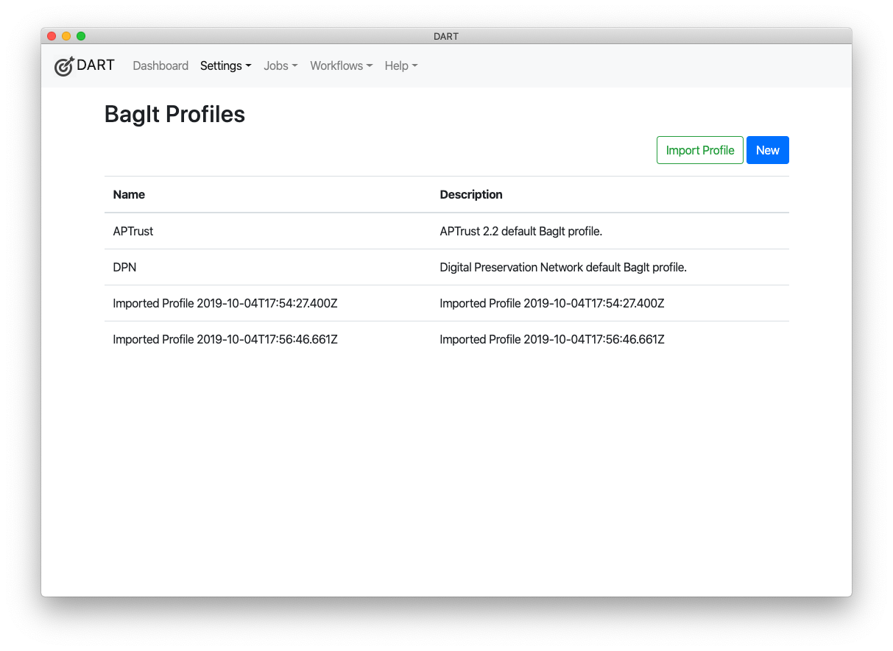
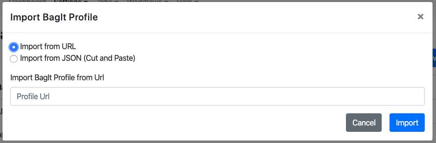
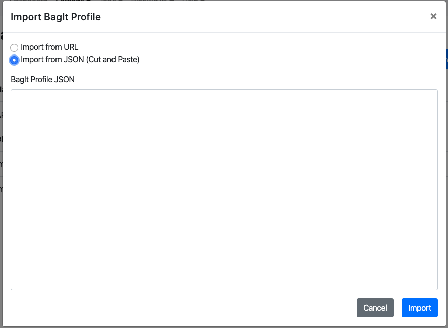

# Importing Profiles

DART can import BagIt profiles that follow the [BagIt Profiles 1.3 specification](https://bagit-profiles.github.io/bagit-profiles-specification/), ordered Library of Congress profiles, such as [SANC State Profile](https://github.com/LibraryOfCongress/bagger/blob/master/bagger-business/src/main/resources/gov/loc/repository/bagger/profiles/SANC-state-profile.json), and unordered Library of Congress profiles like [other-project-profile.json](https://github.com/LibraryOfCongress/bagger/blob/master/bagger-business/src/main/resources/\gov/loc/repository/bagger/profiles/other-project-profile.json).

To import a profile:

1. Choose __Settings > BagIt Profiles__ from the main menu.
1. Click the __Import Profile__ button in the top right corner.

    

1. Option 1: Choose _Import from URL_. Type or paste the URL you want to import, then click __Import__.

    

1. Option 2: Choose __Import from JSON__, paste the BagIt profile JSON you want to import, then click __Import__.

    