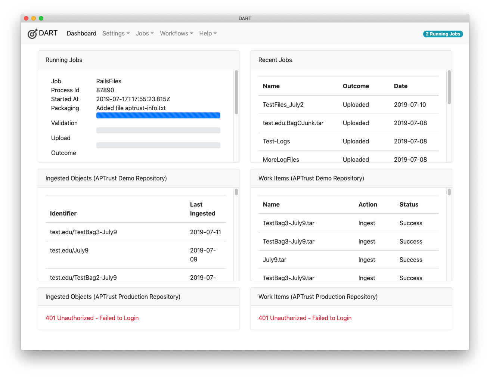
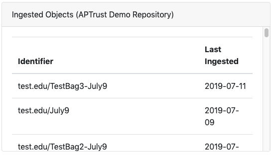
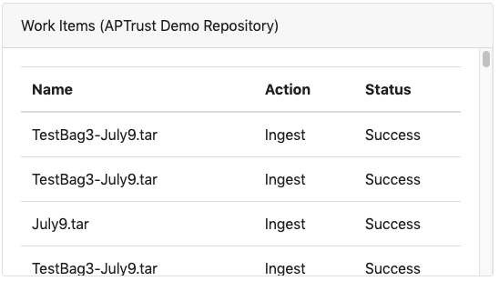

# Dashboard

The dashboard shows running jobs, recently completed jobs, and selected items from remote repositories.

## Running Jobs

The Running Jobs panel shows jobs DART is currently running on your computer. If more than one job is currently running, you can scroll inside the panel to see the progress of each. Also note the blue badge in the upper right corner of the window showing there are two running jobs. The blue badge appears on all DART views as long as jobs are running.

Note that DART runs each job in a separate process. Actions you take in DART do not affect the running jobs.

!!! warning
    When you shut down the DART application, all DART jobs stop, even if they
    are not yet complete. Don't close the DART window while jobs are running,
    unless you intend to stop all of the jobs.

### Progress Bars for Running Jobs

The progress bars for running jobs show how much progress DART has made in each of the job's steps, which may include packaging, validation, and/or uploading.

!!! info
    While the progress bars for packaging and validation are very accurate, the
    progress bar for uploads runs slightly ahead of the actual upload progress.
    DART knows how many bytes of an upload it has prepared to send, but not how
    many have been received by the remote host. It's common for the upload
    progress bar to appear to stall at about 98% while the last chunk of data
    goes across the wire. For smaller uploads, the stall may last only a second
    or two. For very large uploads, the final chunk may be hundreds of megabytes
    and may take several minutes to complete.

## Recent Jobs

The Recent Jobs panel lists recently completed jobs. The Outcome column shows the job's last completed step, while the Date column shows when that step was completed. You can get more detailed information by clicking <b>Jobs &gt; List</b> from the top menu.

See also: [Jobs](jobs/index.md)

## Repositories

The Repositories panels show items from remote repositories that DART knows how to connect to. In the screenshot above, this panel shows items recently ingested into APTrust's demo repository:

The panel below shows a list of pending or recently completed tasks from APTrust demo system. Some repository panels, such as those from APTrust, show additional information when you mouse over an item.

The panels show errors if they cannot communicate with the remote repository. If you run into errors like this, chances are your [Remote Repository](settings/remote_repositories.md) is incorrectly configured.

!!! info
    Remote repository panels require both a correctly configured Remote Repository
    setting and a plugin that knows how to communicate with the remote repository.
    Plugins are typically written by developers associated with the repository,
    and are packaged with the DART installation.

See also: [Remote Repository](settings/remote_repositories.md)
